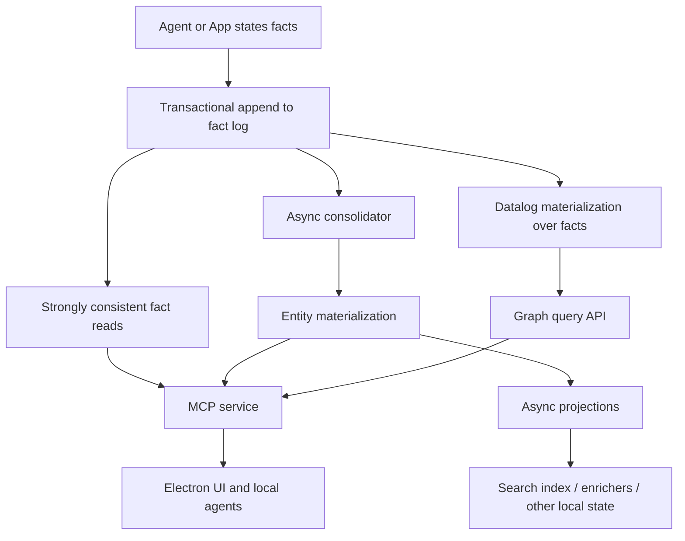

# RFD0001 - Initial Architecture

- Feature Name: `initial-architecture`
- Start Date: `2026-03-12`
- RFD PR: `TBD`
- Poneglyph Issue: `TBD`

## Summary
[summary]: #summary

Poneglyph is a local-first graph database whose unit of knowledge is the fact. Facts are immutable, append-only statements about entities identified primarily by URI. Facts are written atomically in batches, consolidated asynchronously into emergent entity objects, and projected asynchronously into secondary systems such as full-text search and external enrichers. Poneglyph will be packaged as a macOS desktop application with a JavaScript/Electron frontend and a Rust daemon that owns storage, consolidation, projections, query execution, and the MCP service.

## Motivation
[motivation]: #motivation

Agents, local applications, and personal software need a durable memory substrate that can accept contradictory information over time, preserve provenance, and support both exact historical reads and higher-level derived views. Existing application data models tend to force one of two poor choices:

- overwrite mutable records and lose the history of how the system came to know something
- keep an event log but provide weak support for canonicalized objects, graph traversal, and derived indexes

Poneglyph is intended to bridge that gap.

The core object in Poneglyph is a fact:

`(fact_id, stated_by, stated_at, entity, field, value, retracted, tx_id)`

In practice, `entity`, `field`, `stated_by`, and many values are URIs. For example:

- `spotify:album:1xndb8d9an`
- `spotify:displayName`
- `spotify:byArtist`
- `spotify:artist:2910301nxo`

This is effectively an RDF-like triple store with provenance, transaction grouping, and retraction.

Poneglyph needs this architecture for several concrete use cases:

- Personal memory for agents.
  Agents must be able to state facts without coordinating on a mutable canonical record, and later query both raw evidence and consolidated objects.
- Local enrichment pipelines.
  A projection can observe IMDB or Spotify facts, talk to external APIs, and feed new facts back into the graph without breaking the append-only history.
- Search and retrieval.
  Querying the full fact graph directly is expensive for user-facing search, so asynchronous secondary indexes are required.
- Durable graph reasoning.
  Datalog-style graph queries should run over facts, with stronger consistency guarantees than optional background projections.
- Desktop productization.
  The system should run as a local service on macOS, start with the machine, expose an MCP surface to agents, and provide an operator UI for inspection and control.

The main product goal is not just to store data, but to make "absolute memory" available to local agents in a form that is durable, replayable, inspectable, and extensible.

## Guide-level explanation
[guide-level-explanation]: #guide-level-explanation

Poneglyph stores knowledge as facts, not rows in mutable domain tables.

An application does not "update an album". It states facts about an album:

- `spotify:album:1xndb8d9an isA spotify:album`
- `spotify:album:1xndb8d9an spotify:displayName "2112"`
- `spotify:album:1xndb8d9an spotify:byArtist spotify:artist:2910301nxo`

Those facts are appended durably as one transaction. If the batch is accepted, every fact in the batch receives the same `tx_id`. If the batch fails, none of them are stored.

Later, a consolidator reads facts for `spotify:album:1xndb8d9an` and materializes the current emergent entity:

```json
{
  "uri": "spotify:album:1xndb8d9an",
  "namespace": "spotify",
  "kind": "album",
  "spotify:displayName": "2112",
  "spotify:byArtist": "spotify:artist:2910301nxo"
}
```

This entity is not the source of truth. It is a deterministic derived view over facts.

If a later fact says:

- `spotify:album:1xndb8d9an spotify:displayName "2112 (Remastered)"`

then the default consolidation rule is "new field wins". The fact log preserves both statements. The consolidated entity presents the newest active value for that field.

If a fact needs to be undone, Poneglyph appends retraction facts. It does not mutate or delete historical facts. This preserves the full history of statements and allows replay.

Facts are the strongly consistent read model. Immediately after a successful write, exact fact reads must reflect the new transaction.

Everything else is eventually consistent:

- consolidated entities
- full-text search
- external enrichers
- any other projection

This means operators and application developers should think of Poneglyph in layers:

1. The fact log is the durable truth.
2. Consolidated entities are the default object view.
3. Projections are specialized read models or side-effecting workers.
4. Datalog is the graph query layer over facts.

### sameAs and canonical identity

Different URIs may refer to the same underlying thing. Poneglyph handles this with `sameAs` facts.

For example:

- `borg:album:rush-2112 sameAs spotify:album:1xndb8d9an`
- `musicbrainz:release:abc sameAs spotify:album:1xndb8d9an`

During consolidation, these identities are merged into one equivalence class. The consolidated entity represents the merged object, while the fact log preserves every original statement and URI.

This RFD does not fully specify long-term canonical URI selection policy. It only requires that consolidation merge `sameAs` identities deterministically.

### Projections

A projection is a worker that consumes facts or entities and maintains some secondary state.

Examples:

- Search projection:
  reads consolidated entities and maintains a local full-text index such as Tantivy.
- IMDB rater projection:
  observes IMDB-related facts, calls external APIs, and states new facts back into Poneglyph.

Projections are intentionally allowed to maintain their own local state and perform external I/O. They must, however, be idempotent and replay-safe by design.

### Desktop product model

Poneglyph runs on macOS as two cooperating local components:

- `poneglyphd`, a Rust daemon
- `Poneglyph.app`, an Electron application with a JavaScript frontend

The Rust daemon owns:

- fact storage
- transaction assignment
- consolidation
- projection scheduling
- Datalog execution
- MCP service endpoints

The Electron application owns:

- the operator UI
- onboarding and local controls
- process management UX
- inspection of facts, entities, projections, and health

This separation allows the memory system to stay available to agents even when the UI is not open.

### Diagram



## Reference-level explanation
[reference-level-explanation]: #reference-level-explanation

## Core data model

The canonical write model is the fact record:

- `fact_id`
- `stated_by`
- `stated_at`
- `entity`
- `field`
- `value`
- `retracted`
- `tx_id`

Additional storage-level fields may exist, but every persisted fact must preserve these semantics.

### URI conventions

Poneglyph uses URI-shaped identifiers as its primary namespace boundary. Examples:

- entity URIs: `spotify:album:1xndb8d9an`
- field URIs: `spotify:displayName`
- actor URIs: `agent:codex:local`
- transaction URIs or IDs: implementation-defined, but ordered

The storage layer may encode `tx_id` as UUIDv7 or another value with a total order over time. The requirement is monotonic ordering semantics suitable for replay, debugging, and consolidation precedence.

## Fact writes

`state_facts([facts...])` is the transaction boundary.

Required invariants:

- the input batch is atomic
- every accepted fact is appended exactly once
- every fact in a batch shares one `tx_id`
- no accepted write mutates older facts
- retractions are represented as new appended facts, not updates in place

The storage engine must commit the fact batch and any strongly consistent write-side indexes in one database transaction.

This differs from the current prototype in `old-borg-memory`, where fact writes are inserted individually and retractions are modeled as updates to prior rows. Poneglyph should correct both behaviors.

## Retractions

Retractions are facts.

This RFD does not require a single universal encoding, but the semantics are:

- a retraction references or identifies one or more prior facts
- the original facts remain in history
- reads that exclude retracted facts must compute active facts from the append-only log plus retractions

One acceptable implementation is a dedicated retraction fact whose value references a prior `fact_id`. Another is a normalized tombstone relation in the same append-only log. The key requirement is immutable history.

## Consolidation

Consolidation is an asynchronous, deterministic function from relevant active facts to a materialized entity object.

Inputs:

- all active facts for an entity
- any related `sameAs` identity set
- future authority rules, when implemented

Outputs:

- a canonicalized entity document
- metadata about the consolidation point, such as last processed transaction

Default field conflict rule:

- for cardinality-one fields, newest active fact wins
- for cardinality-many fields, consolidation may preserve a set or ordered list, depending on field semantics

Ordering is determined by total transaction order, with a secondary deterministic tiebreaker if needed.

### sameAs consolidation

The consolidator must compute identity equivalence classes induced by `sameAs` facts and merge facts across the class into one emergent entity view.

This implies:

- consolidation input scope may span multiple raw entity URIs
- a lookup by any alias URI should be able to resolve to the merged entity view
- canonical URI selection must be deterministic, even if the long-term policy evolves later

This RFD intentionally defers richer authority weighting and canonical selection rules.

## Projection architecture

Projections are asynchronous consumers of committed facts or consolidated entities.

Each projection has:

- a stable projection name
- a cursor or checkpoint
- isolated local state
- replay support
- idempotent application semantics

Projections may:

- maintain private local databases or index files
- perform network I/O
- derive and state new facts back into Poneglyph

Projections must not assume exactly-once delivery. They must be safe under replay and duplicate processing.

### Search projection

The search projection should maintain its own local full-text store rather than forcing search into the primary fact database. Tantivy is a likely default because it fits the local desktop product model well.

The search projection should consume consolidated entities, not raw facts, because user-facing search generally wants the current merged view of an entity.

### External enricher projections

An enricher such as `imdb-rater` listens for relevant facts or entity updates, performs external reads, and states new facts. Enrichers must declare their source identities clearly in `stated_by` so later authority rules can reason about provenance.

## Query model

Poneglyph supports multiple read paths:

- exact fact reads over the append-only log
- consolidated entity reads
- projection-backed reads such as full-text search
- Datalog graph queries over facts

Datalog queries run over facts, not over the consolidated entity documents.

Because graph traversal is expensive and should not lag writes arbitrarily, the fact write transaction should update whatever materialization or index the Datalog engine requires as part of the same strongly consistent write path.

This means Datalog is logically "projection-like" but operationally on the synchronous side of the architecture.

## Process architecture

The system is split into two local processes:

### `poneglyphd`

Responsibilities:

- own the primary storage directory
- expose write and read APIs
- execute fact transactions
- maintain synchronous query-side indexes required for fact reads and Datalog
- run or supervise consolidation and projections
- expose MCP for local agents
- expose health, projection lag, and replay controls

### `Poneglyph.app`

Responsibilities:

- ship the JavaScript/Electron frontend
- launch and connect to `poneglyphd`
- present a local operator console
- allow inspection of facts, entities, projections, query results, and logs
- configure startup at login on macOS

The daemon should remain the real service boundary. The Electron app is a local client and controller for that service.

## macOS packaging and startup

The intended deployment model is:

- a signed macOS app bundle for the UI
- a bundled Rust daemon binary
- local app support directory for storage
- start-on-login support so Poneglyph can act as ambient memory infrastructure

The app may supervise the daemon directly, or install it with `launchd`. The exact bootstrapping mechanism can be resolved during implementation. The architectural requirement is that agents can access the MCP service even when the main window is closed.

## Observability and replay

Every projection should support:

- current cursor / last applied transaction
- replay from zero
- replay from a chosen cursor
- visible error state
- idempotent duplicate handling

The operator UI should expose:

- fact transaction history
- consolidation lag
- per-projection lag and failure status
- replay controls

## Schema and authority

Schema management is explicitly deferred.

For the initial architecture:

- fact writes are permissive
- invalid or unexpected data may be accepted
- warnings may be surfaced later during reads, consolidation, or diagnostics

Authority rules are also deferred.

For the initial architecture:

- any local writer may state facts
- `stated_by` must still be preserved
- future authority weighting must be able to reuse the historical provenance already captured

This means the storage model must not collapse or discard provenance even if current consolidation ignores it.

## Drawbacks
[drawbacks]: #drawbacks

- The architecture is more complex than a mutable document store.
- Eventual consistency for entities and projections introduces temporary divergence between fact reads and user-facing views.
- `sameAs` merging increases consolidation complexity and makes canonical identity policy harder to evolve.
- Running a Rust daemon plus an Electron UI increases packaging and operational surface area on macOS.
- Strongly consistent Datalog updates on the write path may reduce write throughput.

## Rationale and alternatives
[rationale-and-alternatives]: #rationale-and-alternatives

Why this design:

- It preserves full historical evidence while still offering convenient current-state reads.
- It separates the durable truth from optional or expensive materialized views.
- It lets projections evolve independently and maintain specialized storage.
- It keeps correctness-sensitive storage and query logic in Rust while allowing rapid UI iteration in JavaScript.

Alternatives considered:

- Mutable entities as the primary record.
  Rejected because provenance, replay, and conflict handling become weaker.
- Fully synchronous everything.
  Rejected because search, enrichment, and other projections should not block fact writes.
- Single-process desktop app with all logic inside Electron/Node.
  Rejected because the storage and runtime core benefit from Rust’s reliability and from existing implementation work.
- Treat Datalog as a purely async projection.
  Rejected because graph queries should not lag committed writes in arbitrary ways.
- Tauri desktop app.
  Rejected for product reasons; the frontend should be built in a JavaScript/Electron stack.

## Prior art
[prior-art]: #prior-art

- RDF triple stores and quad stores.
  Poneglyph shares the fact/triple foundation, but emphasizes local-first product packaging, provenance, retractions, and application projections.
- Event sourcing systems.
  Poneglyph adopts append-only history and replay, but facts are more graph-shaped than domain-event shaped.
- Datomic and related immutable database systems.
  The append-only fact log, transaction ordering, and derived current-state reads are closely related ideas.
- Materialized view architectures in stream processors.
  Projections resemble replayable, idempotent consumers that maintain secondary indexes or side effects.
- Search indexers such as Lucene/Tantivy pipelines.
  Search is treated as a derived view rather than a primary storage concern.

## Unresolved questions
[unresolved-questions]: #unresolved-questions

- What exact append-only encoding should retraction facts use?
- What canonical URI selection policy should be used for `sameAs` equivalence classes?
- What storage engine and indexing strategy should back strongly consistent Datalog queries?
- Should the daemon expose MCP only, or also a first-party HTTP API for the Electron app?
- Should consolidation materialize one merged entity per alias set, or also preserve per-URI derived entity views?
- How should projection scheduling and isolation work when one projection feeds new facts into the system at high volume?
- How should local multi-process locking and upgrades be handled for the primary data directory on macOS?

## Future possibilities
[future-possibilities]: #future-possibilities

- Schema-aware validation, warnings, and migration tooling.
- Authority and trust rules that weigh facts differently by `stated_by`.
- Multi-user or remote replication models.
- Time-travel reads for entities as of a transaction or timestamp.
- Richer graph query planning and hybrid queries across facts and projections.
- Projection sandboxing and permission controls for external I/O.
- Agent-facing tooling for bulk import, provenance inspection, and fact explanation.
