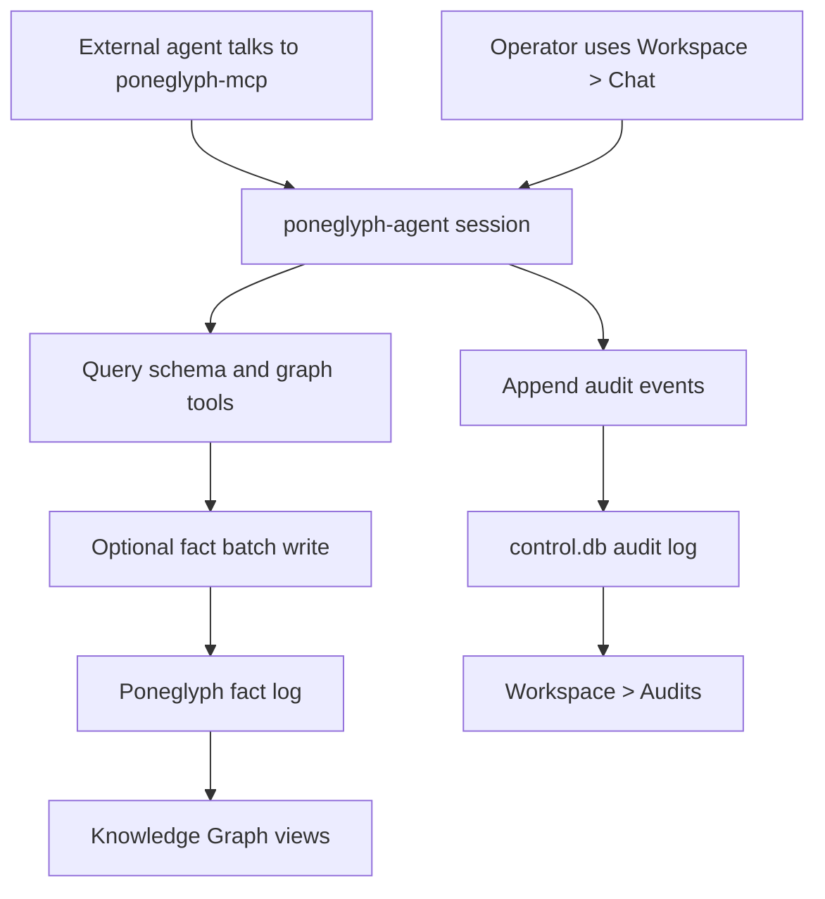

# RFD0005 - Poneglyph Agent

- Feature Name: `poneglyph-agent`
- Start Date: `2026-03-26`
- RFD PR: `TBD`
- Poneglyph Issue: `TBD`

## Summary
[summary]: #summary

Poneglyph will introduce a built-in agent, `poneglyph-agent`, whose job is to
be an expert operator over the Poneglyph knowledge graph and expose that
expertise to other agents.

This agent is not just "an LLM hooked up to some tools". It is a product
capability with a specific operating model:

- schema-first reasoning
- tool-mediated graph access
- append-only fact writing
- auditable real-world runs
- development-only evals

The primary product workflow is:

1. install and configure `poneglyph.app`
2. connect an AI provider for inference
3. expose `poneglyph-agent` through `poneglyph-mcp`
4. let outside agents talk to that built-in expert instead of learning the full
   Poneglyph surface themselves

The first end-to-end slice includes:

- an AI provider configuration flow in Settings for connecting ChatGPT/OpenAI as an inference provider
- `poneglyph-mcp` support for sending messages to `poneglyph-agent`
- a `Workspace > Chat` surface where humans can talk to `poneglyph-agent` for testing and operator debugging
- a `Workspace > Audits` surface where humans can inspect real agent actions
- one initial eval that verifies a core behavior during development

This RFD defines the role of `poneglyph-agent`, its runtime boundaries, its
first product surfaces, and the separation between production audits and
development evals.

## Motivation
[motivation]: #motivation

Poneglyph is intended to be a semantic data layer for AI agents. The real
product goal is not "people chat with Poneglyph in its own app". The real goal
is that other agents such as ChatGPT desktop, Codex, or future local agents can
use Poneglyph safely and effectively through a stable interface.

In theory, every outside agent could connect to Poneglyph, learn its schemas,
discover its connectors, understand its query language, inspect entities, and
decide how to state new facts safely.

In practice, that is too much cognitive and tool-learning burden to push onto
every agent.

We need one built-in expert agent that already understands how to operate this
system well.

That agent should:

- inspect schema before acting
- search existing entities before inventing new ones
- use Poneglyph-native tools instead of free-form guessing
- decompose information into explicit facts
- explain its actions through a durable audit trail

This gives us two immediate benefits:

1. Other agents get a specialization point.
   Instead of teaching every external agent the full Poneglyph runtime model,
   they can delegate graph-heavy work to `poneglyph-agent` over MCP.
2. Humans get a local harness for testing and operator debugging.
   They can use the app chat surface to exercise the same agent directly while
   developing prompts, tools, and product behavior.

## Guide-level explanation
[guide-level-explanation]: #guide-level-explanation

`poneglyph-agent` is a built-in operator for the knowledge graph.

You configure an AI provider once in Settings. For the first slice, that means connecting ChatGPT/OpenAI credentials so Poneglyph can make model calls. This does not give Poneglyph access to your ChatGPT history or conversations. It only gives Poneglyph an inference backend.

Once a provider is configured, `poneglyph.app` runs `poneglyph-mcp` and exposes
`poneglyph-agent` to external agents. That is the primary path.

The expected end-user workflow is:

1. install and configure `poneglyph.app`
2. connect data sources and an AI provider
3. let another agent connect to local `poneglyph-mcp`
4. that outside agent sends work to `poneglyph-agent`
5. `poneglyph-agent` queries schema, reads graph data, and optionally states new facts

`Workspace > Chat` exists as a local harness for testing the same behavior from
inside the app.

Examples:

- "What kinds of Spotify entities do I have?"
- "Find the calendar events next week that mention Prague."
- "I watched Dune last night. Add that to my graph."

The expected operating style is:

1. inspect schema and existing data first
2. search for matching entities before creating anything new
3. if new information should be recorded, decompose it into facts
4. state facts in explicit batches
5. record the run in audits

That last step matters. A real agent run is not just an opaque chat completion.
It is a product event with consequences, whether it originated from in-app chat
or from another agent over MCP. So Poneglyph must record what the agent did:

- what question it received
- which tools it called
- whether writes happened
- whether the run succeeded or failed

Those records appear under `Workspace > Audits`.

### What contributors should assume

- `poneglyph-agent` is primarily an agent-facing subsystem, not just a local
  chat experiment.
- It should rely on Poneglyph-native tools and schemas, not hidden prompt magic.
- It should prefer reads before writes.
- It should treat facts as durable truth and entities as derived views.
- All real runs should be auditable.
- Evals are for development only and should not be surfaced to end users as audits.

### Diagram

## Reference-level explanation
[reference-level-explanation]: #reference-level-explanation

## Scope

This RFD covers:

- the role and boundaries of `poneglyph-agent`
- AI provider configuration for model inference
- MCP exposure of `poneglyph-agent`
- the first chat product surface
- the first audit product surface
- the development-time eval boundary

This RFD does not fully specify:

- long-term multi-agent orchestration
- policy enforcement and permission grants
- cloud-hosted inference brokering
- autonomous background planning loops

## Core concepts

### AI provider

An AI provider is configuration that lets Poneglyph run models.

Examples:

- OpenAI / ChatGPT-compatible provider
- future Anthropic provider
- future local model provider

An AI provider is not a connector because it does not expose user-owned resource data into the graph. It provides compute to Poneglyph.

Provider configuration belongs in Settings.

### Agent session

An agent session is one interactive run or conversation context for `poneglyph-agent`.

For the first slice, sessions may originate from:

- another agent through `poneglyph-mcp`
- `Workspace > Chat` inside the app

The MCP path is primary. The app chat path is a local harness.

Each session has:

- a stable session id
- a configured provider/model target
- a sequence of user and assistant turns
- tool usage
- optional fact writes
- audit records

### Tool surface

`poneglyph-agent` should not reach into the database directly. It should operate through a typed tool surface that encodes Poneglyph-native semantics.

The v1 tool set should focus on graph understanding and safe writes:

- schema discovery
- connector and resource inspection
- entity search
- exact entity read
- graph query execution
- state facts

Representative tool names:

- `list_namespaces`
- `list_kinds(namespace)`
- `describe_schema(namespace, kind)`
- `search_entities(query, filters)`
- `read_entity(uri)`
- `query_facts(datafox_query)`
- `state_facts(batch)`

The exact names can change, but the boundary should remain tool-based and typed.

## Runtime architecture

`poneglyph-agent` should be implemented as its own crate and use the existing `agents` crate as the execution runtime.

Expected shape:

- `poneglyph-agent`
  - system prompt / operating instructions
  - typed message model
  - typed tool enum + tool runner
  - provider selection/configuration
  - audit hooks

The `agents` crate already provides the right primitives:

- `SessionAgent` for turn-based agent execution
- typed tool definitions and envelopes
- pluggable LLM runner/provider model

This lets Poneglyph focus on domain behavior instead of building another agent runtime from scratch.

`poneglyph.app` should remain the process boundary that owns the local product
surface. It runs or hosts:

- the local daemon/runtime
- `poneglyph-mcp`
- the built-in `poneglyph-agent`

`poneglyph-mcp` should expose a direct way for outside agents to send messages
to `poneglyph-agent` and receive its responses, rather than only exposing low
level raw graph tools.

## Operating rules

`poneglyph-agent` should be taught and tested against the following behavioral constraints:

1. Schema-first.
   Before making claims about a namespace or kind, inspect schema when needed.
2. Search before write.
   Before inventing a new URI or entity, search the graph for an existing match.
3. Facts, not mutable records.
   New knowledge should be emitted as explicit fact batches, not implicit updates to derived entity state.
4. Explainable action path.
   Real runs must produce audit events at meaningful boundaries.

These are not just prompt suggestions. They should shape tools, audits, and evals.

## AI provider configuration

The first supported provider is ChatGPT/OpenAI-compatible inference.

This should be configured under Settings, in a section such as:

- `Settings > AI Providers`

Stored data likely includes:

- provider key
- display name
- base URL if configurable
- API key or credential reference
- default model
- enabled/disabled status

This configuration belongs in `control.db`, not in the graph.

The initial product copy should be explicit:

- this connects an AI provider for inference
- this does not import your ChatGPT conversations

## Product surfaces

### MCP agent surface

This is the primary entrypoint for `poneglyph-agent`.

Requirements for v1:

- another local agent can discover and use `poneglyph-agent` through
  `poneglyph-mcp`
- the MCP surface can send a message to the agent and receive a response
- the agent can use its Poneglyph-native tools during that run
- the run is audited exactly like an in-app run

### Workspace > Chat

This is a human-facing harness for testing and operator debugging of
`poneglyph-agent`.

Requirements for v1:

- regular chat interface
- streamed responses if feasible
- visible tool activity when possible
- clear failure messages

The point of this page is not generic chatbot novelty. It is to exercise and
debug the same Poneglyph-specific agent behavior that outside agents will use
over MCP.

### Workspace > Audits

Audits are a product surface for real agent activity.

They should show:

- recent runs
- run status
- timestamps and duration
- tool calls
- fact write attempts and outcomes
- terminal success/failure

Audits are append-only runtime records for real runs.

### Knowledge Graph integration

As `poneglyph-agent` states facts, those facts should become visible through the existing Knowledge Graph views after ordinary consolidation/projection flow.

The agent is not a special write path. It uses the same `state_facts(...)` semantics as any other producer.

## Audits

Audits are one subsystem of `poneglyph-agent`, not the whole feature.

The audit model should be append-only and db-backed. The exact schema can be finalized during implementation, but it should support:

- run records
- ordered event records per run
- redacted payloads
- filtering by status, time, and agent key

Representative event types:

- `run_started`
- `input_received`
- `tool_call_started`
- `tool_call_succeeded`
- `tool_call_failed`
- `facts_state_requested`
- `facts_state_succeeded`
- `facts_state_failed`
- `run_finished`

Audit data is product/runtime data.

## Evals

Evals are explicitly not audits.

They are development-only agentic tests used to verify that `poneglyph-agent` behaves correctly as code and prompts evolve.

The existing `evals` crate is a good fit for this because it already provides:

- suite/eval authoring
- transcript-style trajectories
- deterministic and judge-based grading
- repeatable local/CI execution

For the first slice, we should add at least one real eval that checks a core operating rule.

Recommended first eval:

- `search_before_write`

The scenario should require the agent to add information, but only after it has first searched the graph for an existing matching entity.

That eval belongs in development workflow and CI. It should not be shown in `Workspace > Audits`.

## First vertical slice

The first slice should deliver:

1. Settings page for AI provider configuration
2. OpenAI/ChatGPT-compatible provider support
3. `poneglyph-agent` crate using the `agents` runtime
4. `poneglyph-mcp` support for sending messages to a real local `poneglyph-agent` session
5. `Workspace > Chat` UI wired to the same local agent session machinery as a test harness
6. append-only runtime audits for real runs
7. one eval covering `search_before_write`

This is enough to prove:

- another agent can use the built-in graph expert through MCP
- a human can locally test the same agent in the app
- the agent can use Poneglyph-native tools
- the system can observe and audit real runs
- agent behavior can be regression-tested during development

## Drawbacks
[drawbacks]: #drawbacks

- This adds another major subsystem before all connector and graph capabilities are mature.
- Agent quality will depend partly on prompts and provider behavior, which can be unstable.
- Auditing and redaction add operational complexity.
- A built-in agent raises expectations for correctness and explainability early.

## Rationale and alternatives
[rationale-and-alternatives]: #rationale-and-alternatives

### Alternative: expose raw tools to external agents and stop there

Rejected because this puts too much system-learning burden on every outside agent and weakens the product story for humans.

### Alternative: make in-app chat the primary product

Rejected because the more important integration point is agent-to-agent use
through MCP. The app chat is a convenient harness, not the main destination.

### Alternative: model AI providers as connectors

Rejected because providers are compute backends, not user-data integrations. Mixing them into Connectors would blur the product model.

### Alternative: build chat first and defer audits

Rejected because once the agent can take real actions, lack of inspection becomes an operational liability.

### Alternative: use evals as the audit UI

Rejected because evals are development/test artifacts, not runtime history.

## Prior art
[prior-art]: #prior-art

- Tool-using agent runtimes that separate model reasoning from tool execution.
- Evented audit trails in workflow systems and background job systems.
- Poneglyph's own architectural principle from RFD0001: facts are durable truth, derived views are secondary.

## Unresolved questions
[unresolved-questions]: #unresolved-questions

- What should the exact tool surface be in v1 versus later phases?
- Should chat sessions themselves be persisted as first-class records, or only their audits?
- How much of tool reasoning or intermediate planning should be retained in audits?
- Should provider configuration allow multiple models/providers from the first slice, or only one enabled default?

## Future possibilities
[future-possibilities]: #future-possibilities

- Let external agents delegate graph-heavy work to `poneglyph-agent`.
- Add policy and approval checkpoints for sensitive writes or connector/resource access.
- Introduce specialized sub-agents for extraction, reconciliation, and enrichment.
- Add background agent workflows driven by connector updates or ingestion jobs.
- Add richer eval suites for schema reasoning, fact extraction quality, and canonical identity resolution.
